## Outline

* Peptide microarray overview
* RV144 immunogenicity
* Definition of our peptide microarray immune variables
* Review of the RV144 correlate study results
* Correlate analysis using our derived variables (focus on V2 and V3)
* Comparison of RV144 to other vaccine regiments

---

## Array design overview and goals

* Identify regions of the HIV viral envelope that elicit antibodies during natural infection or after vaccination
* Array of overlapping gp160 peptides:
    * Peptides mosaic designed by Bette Korber at LANL
    * 1423 peptides (15 mers) across 7 sub-types
    * Serum + secondary antibody = Reactive peptides

* Data analyzed as described in Imholte *et al.* (2013, submitted to *JIM*).

---

## Aggregate-response<sup>*</sup> rate vs. HxB2

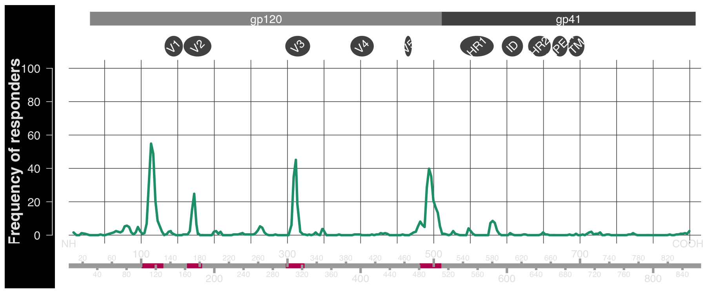

4 hotspots noted as <span class="red">C1, V2, V3, and C5.</span>
V2 hotspots described in <a href="http://www.ncbi.nlm.nih.gov/pubmed/23035746">(Karasavvas *et al.*, 2012)</a>

<span class="source"><sup>*</sup>The aggregate response represents an average of all sub-types.</span> 

---

## Subtype-specific response rates

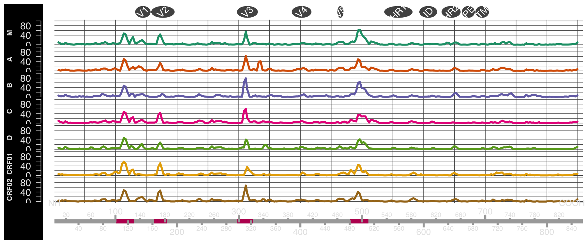


* <span class="white">V2</span>: largest response in CRF01 but <span class="red">virtually no B reactivity.</span>
* <span class="white">V3</span>: largest response in B, less so in CRF01. 

---

## Peptide variables definition

* Defined four reactive regions (hotspots): <span class="red">C1, V2, V3, and C5</span>
* For each region, find the position at the maximum response (*peak summit*)
    * <span class="white">**Aggregate response**</span>: average of all subtypes centered at the maximum position
    * <span class="white">**Subtype-specific responses**</span>: corresponding individual peptide responses
* Total of <span class="white">24 variables</span>: 4 aggregate and 20 subtype variables
* Correlate analysis for these 24 variables using two phase design logistic regression <a href="http://www.ncbi.nlm.nih.gov/pubmed/22475592">(Haynes *et al.*, 2012)</a>

---

## RV144 case-control study overview


* <span class="white"> **Six primary variables** </span>: 5 antibody and 1 cellular responses
    * Plasma IgA antibodies (IgA); The avidity of IgG antibodies; Antibody-dependent cellular cytotoxicity (ADCC); HIV-1 neutralizing antibodies; The binding of IgG antibodies to variable regions 1 and 2 (V1V2) of the gp120 Env (gp70V1V2); The level of Env-specific CD4+ T cells
* <span class="white"> **Results<sup>*: </sup>**</span>
    * gp70V1V2 inversely correlated with infection (estimated odds ratio, 0.71 per 1-SD increase; p=0.063)
    * IgA correlated with infection (estimated odds ratio, 1.39 per 1-SD increase; p=0.0492)

<span class="source"><sup> * </sup>Based on univariate model.</span> 

---

## Odds-ratios for aggregate and primary variables


```
## Error: comparison (1) is possible only for atomic and list types
```

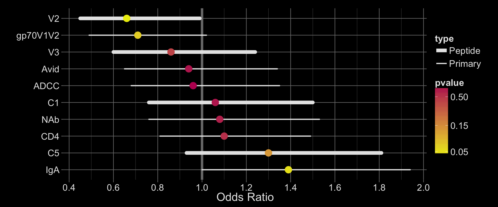


Most significant (inverse) correlation with our V2 aggregate variable <a href="http://www.plosone.org/article/info%3Adoi%2F10.1371%2Fjournal.pone.0053629">(Zolla-Pazner *et al.*, 2013)</a>

---

## Odds-ratios for V2 variables


```
## Error: object 'variable' not found
```

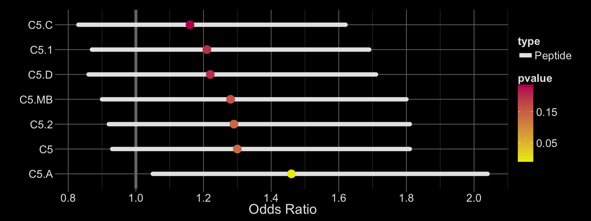

* The V2 subtype-CRF01_AE (V2.1) peptide has the smallest estimated OR (OR=, p=). 
* No decrease in risk with the V2 subtype-B peptide.

---

## V2 tail distribution by subtypes

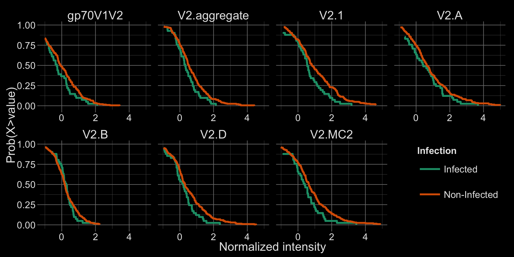


---

## Odds-ratios for C5 variables


```
## Error: object 'variable' not found
```

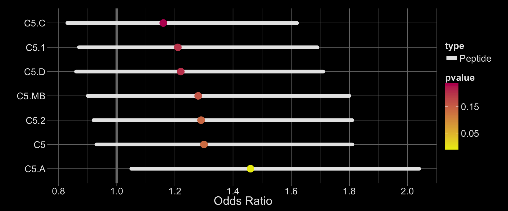

The C5 subtype A peptide is significantly correlated with infection.

---

## C5 tail distribution by subtypes

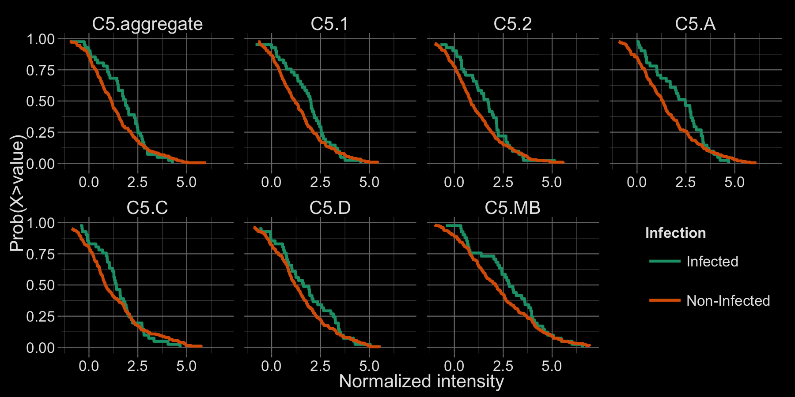


---

## How do gp70V1V2 and V2 variables compare?

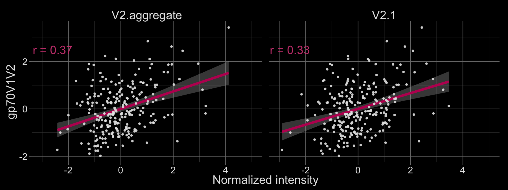


* Weak correlation between the two V2 variables
* Could the two be measuring different antibodies? Likely, yes <a href="http://www.cell.com/immunity/abstract/S1074-7613(12)00552-3">(Liao *et al.*, 2013)</a>.

--- &twocol w1:60% w2:38%

## V2 sieve analysis

*** left

<iframe src="http://www.nature.com/nature/journal/v490/n7420/full/nature11519.html"></iframe>

*** right

* V2 focused Analysis of 936 HIV-1 genome sequences from 44 vaccine and 66 placebo recipients
* Two genetic signatures of RV144 vaccination: K169 and L181


--- &twocol w1:45% w2:45%

## V2 binding and K169

*** left

* Lowest binding in V2 is in subtype B

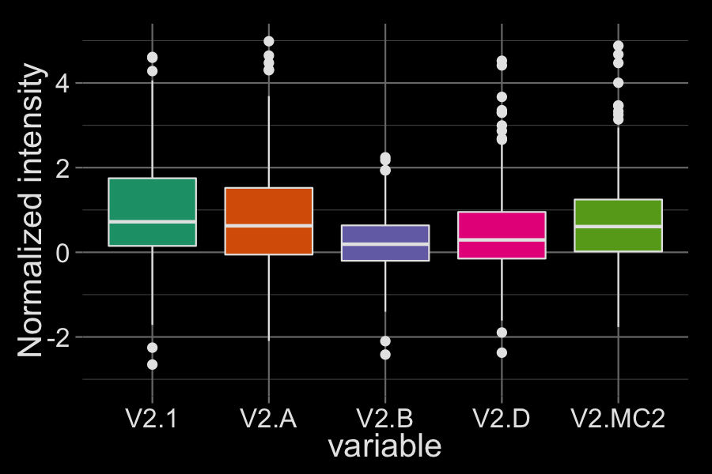


*** right

* Subtype B be at position 169 is not a K

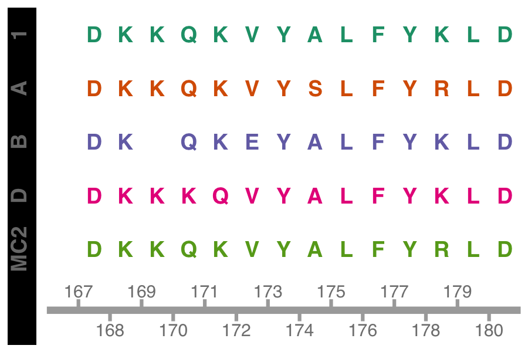


---


## Interaction analyses

* Replicated the analysis presented in Haynes *et al.* (2012)

* Look for interaction between IgA and all peptide microarray variables

>- Significant interaction between IgA an most V3 variables
    * Interaction between IgA and V3-CRF01 (p= 0.0019 )

---

## Effect of IgA on V3


* Significant risk-reduction at low IgA level (p=0.0031 at 20% and p=0.0144 at 50%)

---

## Conditional V3 tail distributions

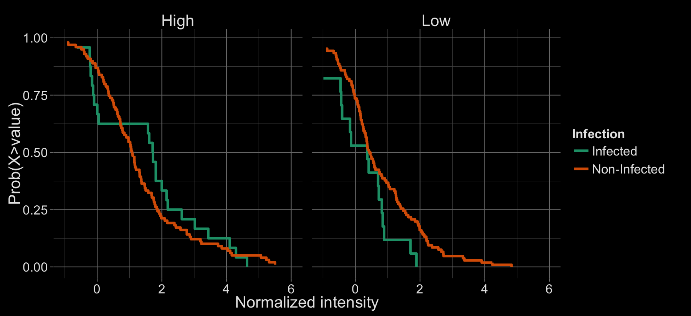

IgA level dichotomized as below (*Low*) or above (*High*) median(IgA)

--- &twocol w1:45% w2:45%

## V3 binding and subtype sequences

*** left

* Some variability in binding intensity

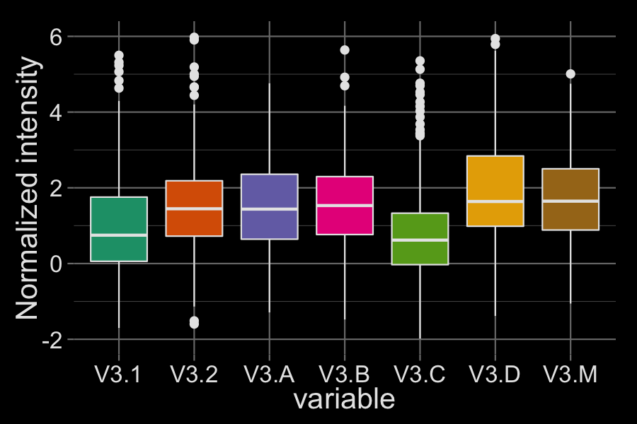


*** right

* V3 hotspot is not as well conserved as the V2 one

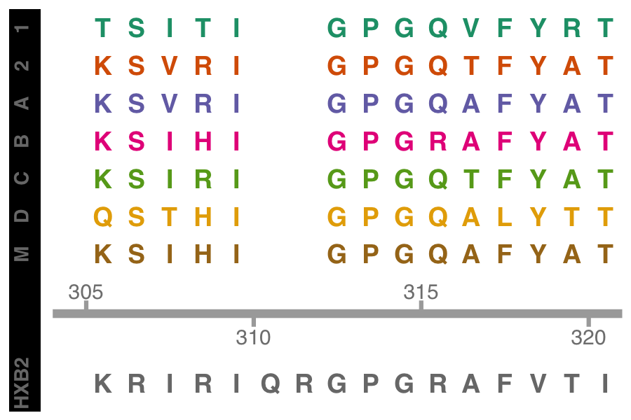


---

## Summary

* The peptide microarray is a nice technology for profiling antibodies and mapping *linear* epitopes
* Validated the <del>V1</del>V2 correlate
    * Support the K169 sieve result
    * Non-neutralizing antibodies might be more important that we thought
* Interesting (conditional) V3 correlate
    * Relation to sieve results?
    * More work to be done (Gottardo *et al.*, In Preparation)

<aside class="note">
<section>
* V2 and not V1?
* Non conformational antibodies are also important
</section>
</aside>

---

## How does RV144 compare?

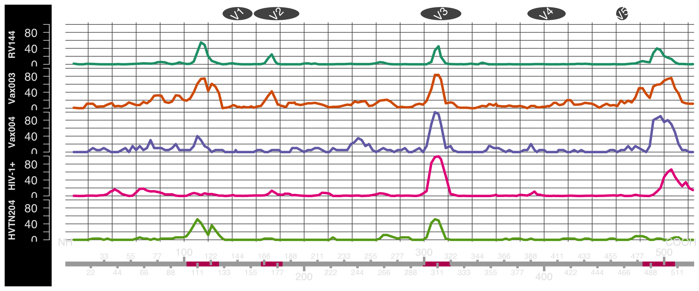

No <span class = 'red'>V2</span> in Vax004, HVTN204, HIV-1+<sup>*</sup><span class="source"><sup> * </sup>Depends on the virus subtype</span>. <span class = 'red'>V2</span> reactivity in Vax003.

--- .thank-you-slide

## Acknowledgments

<aside class="gdbar right"></aside>

* David Montefiori, Xiaoying Shen and Georgia D. Tomaras (Duke)
* <span class="yellow">Greg Imholte, Mike Jiang, Renan Sauteraud</span>, Steve Self, Peter Gilbert, Paul Edlefsen (FHCRC)
* Robert Bailer and Ellen Turk (NIH/NVITAL)
* John Mascola (NIH)
* Bette Korber (LANL)
* MHRP, HVTN and CAVD.


<pre class="prettyprint", data-lang="URL">
<span class="gray4">Want to see it again? &#8594; </span> <a href="http://raphg.github.io/Talks/VIDD-0513/index.html">http://goo.gl/57NhP</a>
</pre>

<a href="https://github.com/raphg/Talks/tree/gh-pages/VIDD-0513"></a>

